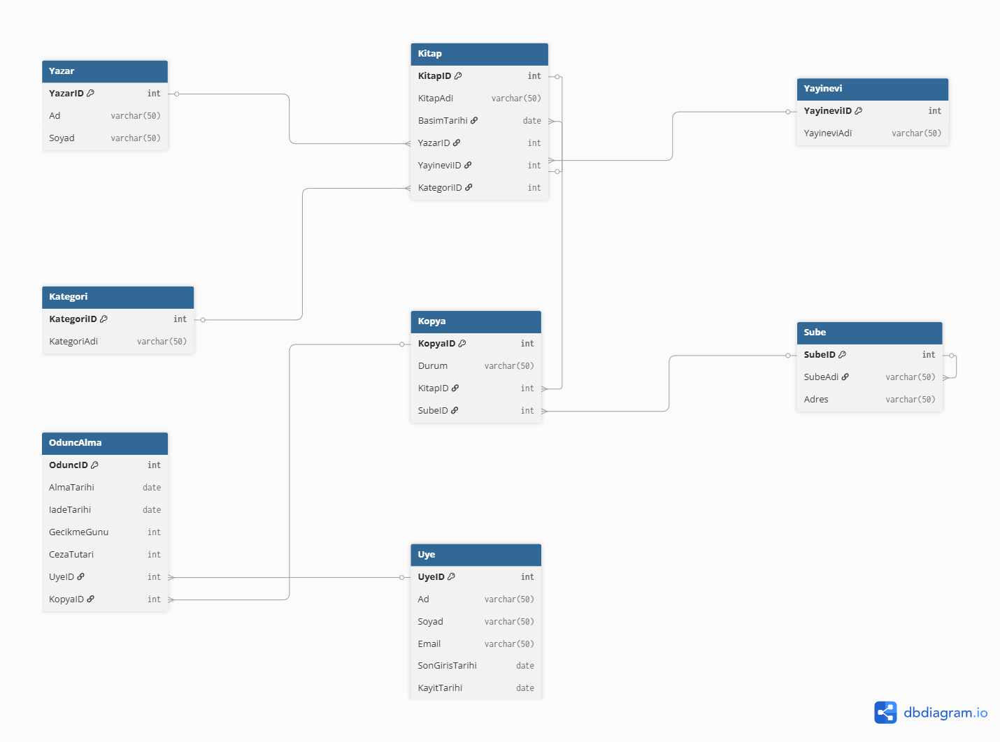

# 📚 Kütüphane Yönetim Sistemi - Veritabanı Tasarımı

Bu proje, bir kütüphane yönetim sisteminin veritabanı tasarımını kapsamaktadır.
Sıfırdan gereksinim analizi, kavramsal model, mantıksal model ve fiziksel model
aşamaları takip edilerek geliştirilmiştir.

## 📋 Gereksinim Analizi

- Sistem, kitap bilgilerini (ad, tür, yayınevi, basım tarihi) kaydedebilmelidir
- Sistem, üyelerin kitap ödünç almasını sağlamalıdır
- Sistem, geciken iadeler için otomatik ceza hesaplamalıdır
- Sistem, iade edilmemiş kitap varken yeni ödünç almayı engellemelidir
- Sistem, kitabın hangi şubede olduğunu takip etmelidir
- Sistem, üye kayıt ve giriş işlemlerini yönetmelidir

## 🗂️ Tablolar

| Tablo | Açıklama |
|-------|----------|
| Yazar | Yazar bilgileri |
| Yayinevi | Yayınevi bilgileri |
| Kategori | Kitap kategorileri |
| Sube | Kütüphane şubeleri |
| Kitap | Kitap bilgileri |
| Kopya | Kitap kopyaları ve şube bilgisi |
| Uye | Üye bilgileri |
| OduncAlma | Ödünç alma işlemleri ve ceza bilgisi |

## 🔗 ER Diyagramı

## 🛠️ Kullanılan Teknolojiler

- Microsoft SQL Server
- SQL Server Management Studio (SSMS)
- dbdiagram.io
